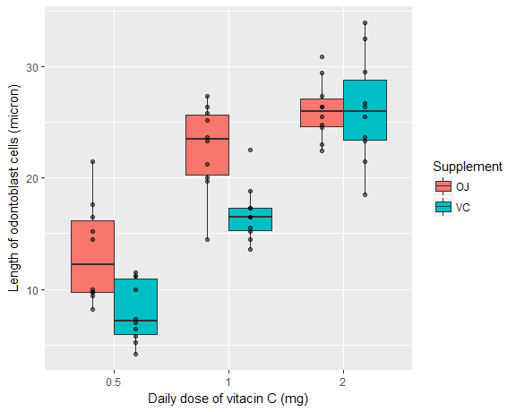
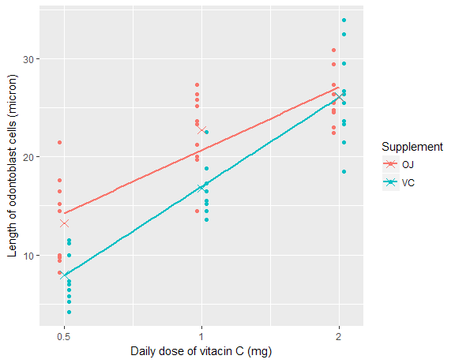

## Background and introduction

In this report I'm going to analyze the ToothGrowth data in the R datasets package. This data is obtained as the result of a study of the effect of graded intakes of vitamin C on the growth of the odontoblast cells in the guinea pig incisor tooth. The data involve measurements of odontoblast response in 60 guinea pigs. The subjects received orange juice (OJ) or synthetic vitamin C (VC), as a source of added vitamin C in their diets, at 3 levels of intake spaced at equal log intervals (0.5, 1, or 2 mg per day). The length of the odontoblast cells (measured in microns) was determined as a measure of effectiveness of each diet.

## Data display and summary

The first thing to do is to load the required packages and the dataset in:


```r
library(dplyr)
library(ggplot2)
library(purrr)
library(coin)
data("ToothGrowth")
```

Now let's run `str` on the data:


```r
str(ToothGrowth)
```

```
## 'data.frame':	60 obs. of  3 variables:
##  $ len : num  4.2 11.5 7.3 5.8 6.4 10 11.2 11.2 5.2 7 ...
##  $ supp: Factor w/ 2 levels "OJ","VC": 2 2 2 2 2 2 2 2 2 2 ...
##  $ dose: num  0.5 0.5 0.5 0.5 0.5 0.5 0.5 0.5 0.5 0.5 ...
```

The data contains 60 observations on 3 variables as discussed earlier. There is no missing value:


```r
map_int(ToothGrowth, ~ sum(is.na(.x)))
```

```
##  len supp dose 
##    0    0    0
```

Next I proceed by constructing a boxplots to get some sense of how the data behaves:


```r
ToothGrowth %>%
    ggplot(aes(x = as.factor(dose), y = len, position = supp)) +
    geom_boxplot(aes(fill = supp), outlier.shape = NA) +
    geom_point(position = position_dodge(width = 0.75), alpha = 0.5) +
    labs(
        x = "Daily dose of vitacin C (mg)",
        y = "Length of odontoblast cells (micron)",
        fill = "Supplement"
    )
```



Looking at the plot above, it seems both supplement and dose make a difference in the odontoblast response. Higher doses of vitamin C results in longer odontoblast cells and natural orange juice is superior to synthetic vitamin C in the stimulation of odontoblast development. A follow-up question would be that do guinea pigs with different vitamin C supplements in their diet respond differently in terms of odontoblast development to the dose of vitamin C they receive? In the next plot, I try to explore this question.


```r
tooth_mean <- ToothGrowth %>% 
    group_by(supp, dose) %>%
    summarise(mu = mean(len))

ToothGrowth %>%
    ggplot(aes(dose, len,  color = supp)) +
    geom_point(position = position_dodge(width = 0.1)) +
    scale_x_continuous(trans = "log",
                       breaks = c(0.5, 1, 2),
                       labels = c("0.5", "1", "2")) +
    geom_smooth(method = "lm", se = FALSE) +
    geom_point(data = tooth_mean, aes(dose, mu, color = supp), shape = 4, size = 3) +
    labs(
        x = "Daily dose of vitacin C (mg)",
        y = "Length of odontoblast cells (micron)",
        color = "Supplement"
    )
```



You can see a strong increasing linear pattern in the data. With intakes of 0.5 to 2 mg of `VC` a day, the relationship of the mean of odontoblast cells length to the logarithm of the daily dose is linear. Also there is evidence of interaction between `dose` and `supp`. An interaction says that there's not a fixed offset: you need to consider both values of `dose` and `supp` simultaneously in order to estimate `len`. In the next section, I will try to formalize this claim with standard tests.

## Testing hypotheses

So far there are 3 hypotheses to be tested:

* Orange juice promotes a greater odontoblast development than synthetic vitamin C.

* With intakes of 0.5 to 2 mg, higher doses of vitamin C result in longer odontoblast cells.

* Dosage level modifies the relationship between vitamin C supplement and odontoblast length.

Let's get started by creating a new `treatment` variable that combines all levels of `supp` and `dose` and then counting the number of observations in each treatment group:


```r
test_data <- ToothGrowth %>%
    transmute(treatment = interaction(supp, dose, sep = "_"), len = len)

test_data %>% 
    group_by(treatment) %>%
    count()
```

```
## # A tibble: 6 x 2
## # Groups:   treatment [6]
##   treatment     n
##      <fctr> <int>
## 1    OJ_0.5    10
## 2    VC_0.5    10
## 3      OJ_1    10
## 4      VC_1    10
## 5      OJ_2    10
## 6      VC_2    10
```

There are 10 observations in each treatment group which implies that the experiment design was balanced.

For the 6 treatment groups in the study, we have to consider 15 tests to compare all pairs of groups. But not all of those tests are relevant to our hypotheses. So I will only choose those pairs whose test is meaningful:


```r
combinations <- list(
    c("OJ_0.5", "VC_0.5"),
    c("OJ_1"  , "VC_1"),
    c("OJ_2"  , "VC_2"),
    c("OJ_1"  , "OJ_0.5"),
    c("OJ_2"  , "OJ_1"),
    c("OJ_2"  , "OJ_0.5"),
    c("VC_1"  , "VC_0.5"),
    c("VC_2"  , "VC_1"),
    c("VC_2"  , "VC_0.5")
)
```

The test statistic which I will use is difference in means and to evaluate that for each pair I will employ both t-test and permutation test. Before proceeding with the tests we should check if the assumptions of each test are satisfied. For two sample t-test we need:

1. independent samples: Based on the [original article](http://jn.nutrition.org/content/33/5/491.full.pdf), the guinea pigs were allotted at random to individual cages so we can safely assume that observations are independent.
 
2. Normally distributed data: Looking at figure 1, the distribution within each group looks quite normal to me. There is some skew in some boxplots but nothing that we won't expect in a sample of 10 observations.

I will also assume equal variance for each t-test since the experiment design was balanced as mentioned above and t-test is highly robust to the presence of unequal variances when the sample sizes in the two groups being compared are equal.


```r
# since for all the tests, the alternative hypothesis is "greater",
# I have to change the order of treatment levels, such that,
# intended difference are produced when applying the `t.test` function
test_data$treatment <- factor(test_data$treatment,
                              levels = c("OJ_2", "OJ_1", "OJ_0.5",
                                         "VC_2", "VC_1", "VC_0.5"))

# creating a list of data frames each containing data for one pair-wise test
df_list <- map(combinations, function(x) filter(test_data, treatment %in% x))

t_test_pval <- map_dbl(df_list, function(x){
    t.test(len ~ treatment,
           data = x,
           alternative = "greater",
           var.equal = TRUE)$p.value
})
```

Then there are multiplicity problems since we're making multiple decisions using multiple P-values. To control for inflation in type I error, I use Bonferroni correction because it does not require any assumptions about dependence among the p-values (test results won't be independent of each other for example $\mu_{OJ\_2} > \mu_{OJ\_1}$, $\mu_{OJ\_1} > \mu_{OJ\_0.5}$ and $\mu_{OJ\_2} > \mu_{OJ\_0.5}$ are dependent tests).


```r
bonf_adjusted_pval <- p.adjust(t_test_pval, method = "bonf")
```
I conclude this section by performing permutation test on each pair of groups. The validity conditions for permutation tests are:

1. Subjects should have been randomly assigned to groups: Each guinea pig was randomly assigned to receive one of the six different treatments.

2. There should have been no interference between units and that the treatment conditions should've been the same for all recipients: The guinea pigs were allotted at random to individual cages and besides different sources of added vitamin C in their diets, were treated similarly.

I'm only using permutation tests to double-check the p-values obtained from the previous t-tests. I won't draw conclusions from results of the permutation tests.


```r
permutation_pval <- map_dbl(df_list, function(x){
    oneway_test(len ~ treatment,
                data = x,
                alternative = "greater",
                distribution = "exact") %>% 
        pvalue
})
```

## Conclusions

Here are the results of the previous tests:


```r
null_hypothesis <- map_chr(combinations, function(x){
    paste0("$\\mu_{\\text{", x[1], "}}-\\mu_{\\text{", x[2], "}}=0$")
})

data.frame(null_hypothesis,
           permutation_pval,
           t_test_pval, 
           bonf_adjusted_pval,
           stringsAsFactors = FALSE) %>%
    mutate(null_rejected = ifelse(bonf_adjusted_pval < 0.05, "yes", "no")) %>%
    knitr::kable(digits = 4, padding = 0)
```


null_hypothesis                              permutation_pval  t_test_pval  bonf_adjusted_pval  null_rejected
-------------------------------------------  ----------------  -----------  ------------------  -------------
$\mu_{\text{OJ_0.5}}-\mu_{\text{VC_0.5}}=0$            0.0026       0.0027              0.0239  yes          
$\mu_{\text{OJ_1}}-\mu_{\text{VC_1}}=0$                0.0007       0.0004              0.0035  yes          
$\mu_{\text{OJ_2}}-\mu_{\text{VC_2}}=0$                0.5206       0.5181              1.0000  no           
$\mu_{\text{OJ_1}}-\mu_{\text{OJ_0.5}}=0$              0.0001       0.0000              0.0004  yes          
$\mu_{\text{OJ_2}}-\mu_{\text{OJ_1}}=0$                0.0173       0.0187              0.1681  no           
$\mu_{\text{OJ_2}}-\mu_{\text{OJ_0.5}}=0$              0.0000       0.0000              0.0000  yes          
$\mu_{\text{VC_1}}-\mu_{\text{VC_0.5}}=0$              0.0000       0.0000              0.0000  yes          
$\mu_{\text{VC_2}}-\mu_{\text{VC_1}}=0$                0.0000       0.0000              0.0002  yes          
$\mu_{\text{VC_2}}-\mu_{\text{VC_0.5}}=0$              0.0000       0.0000              0.0000  yes          

For `VC` higher doses of vitamin intake yield significant result for every pair-wise test, but for `OJ` the difference in means between `OJ_2` and `OJ_1` isn't significant. Also `OJ` proved to be superior to `VC` at the 0.5 mg and 1 mg levels of intake but there is no evidence that `OJ` and `VC` have different true mean growth rates at the 2 mg dosage level. If we put all these pair-wise tests together and also take into account the claim in the original article which says that they have not found satisfactory increased response with intakes of 4 or 8 mg over than that for 2 mg, we may generate an overall interpretation that the curves of expected odontoblast response to dose of vitamin C for both `VC` and `OJ` have the same maximum but `OJ` reaches its highest point somewhere between 1 mg and 2 mg levels of intake. Of course it's impossible to test this claim unless  we have data on vitamin C supplements fed in doses intermediate between 1 mg and 2 mg and above 2 mg.
